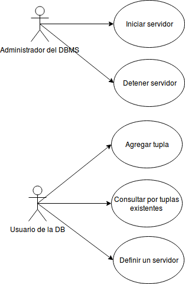
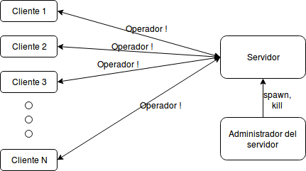
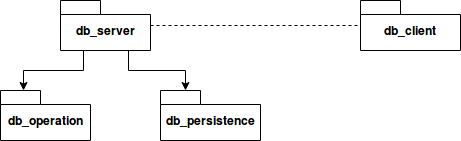

# Técnicas de Programación Concurrentes I
# TP 2 

JTP:

    Ing. Pablo Deymonnaz

Realizador:
 
    Gonzalo Leonel Petraglia

    Padrón: 97811

## Análisis

En este TP se implementara un gestor de bases de datos muy simplificado utilizando la herramienta de colas.

Para que la implementación sea utilizable, se necesita que haya alguna manera de interactuar con el mismo tanto para administrar el servidor como para ejecutar acciones desde el cliente. Además, todo esto debe suceder concurrentemente. La interfaz mas fácil de implementar es una linea de comandos, para lo cual la shell de erlang sera de gran ayuda. 

### Casos de uso

En la siguiente figura se muestran los casos de uso de este sistema:

## 1. Procesos
La implementación brindada consta de 3 procesos:

 1. La shell del cliente (se espera que haya varios clientes por cada servidor)
 1. La shell del servidor
 1. El servidor

### La shell del cliente

Esta shell estrictamente es la shell del programa erl la cual cumple la función de permitir hacer las llamadas al servidor mediante las funciones provistas en el modulo db_client.

### La shell del servidor

Esta shell también es la shell del programa erl y cumple la función de permitir la administración (iniciar y detener) del servidor mediante las funciones provistas en el modulo db_server.

### El servidor

Este es el proceso que recibe los mensajes y administra la base de datos.

## 2. Esquema de comunicación

La comunicación entre los procesos se da solamente entre el servidor y la shell cliente, y entre el servidor y la shell del servidor.

En el primer caso la comunicación debe ser bidireccional e iniciada por el cliente, por lo que el cliente debe enviar un identificador propio para que el servidor pueda responder. Obviamente, el cliente también debe enviar la operación a realizar.

En el segundo caso la comunicación puede ser unidireccional, ya que solo es necesaria para que la shell pueda parar el servidor.

Este esquema se ve representado por la siguiente figura:

## 3. Protocolo de comunicación

El cliente enviara al servidor mensajes a través del operador ! donde el mensaje esta formado por una dupla donde el primer elemento es el PID del cliente y el segundo elemento es la operación. Luego, el servidor enviara la respuesta mediante el mismo operador al PID recibido.

Las operaciones posibles y sus respuestas son las siguientes:

### Add

El esquema básico del mensaje de la operación add es el de una dupla donde el primer elemento es el átomo add y el segundo elemento es la terna a agregar.
Ejemplo:

> {add, {"Gonzalo", "Corrientes 223", "4444"}}

La respuesta puede ser el átomo ok o una dupla formada por el átomo error y el error.
Ejemplo:

> {error, "Duplicated entry"}

### Select

El esquema básico del mensaje de la operación select es el de una dupla, siendo el primero el átomo select y el segundo los filtros a aplicar.
Ejemplo:

> {get, [{address, "Corrientes 223"}, {name, "Gonzalo"}]}

La respuestas posibles son similares a la de la operación add.

## Diagramas de clases

No existe un diagrama de clases dada la naturaleza funcional de erlang, en cambio se presenta un diagrama de módulos.

